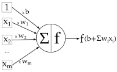
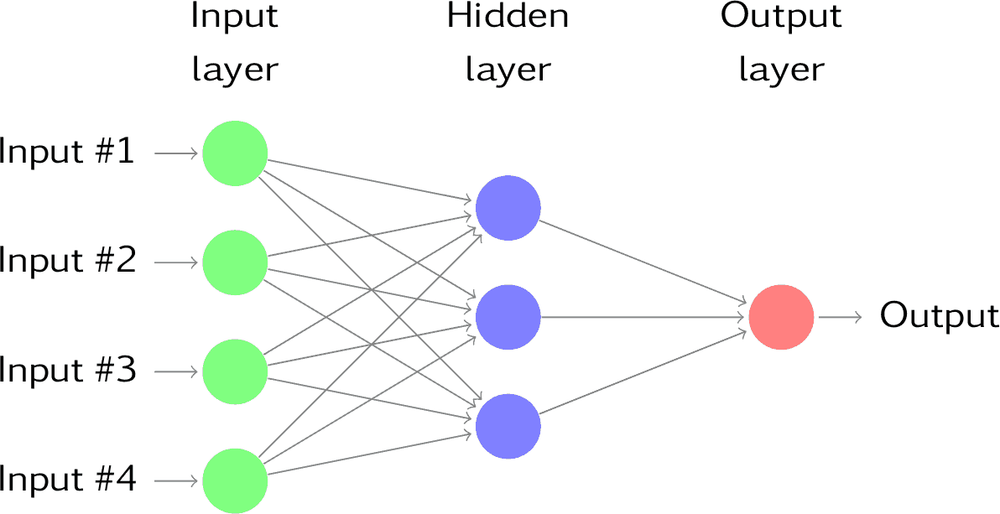
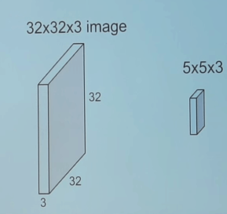
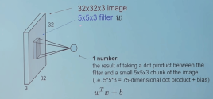
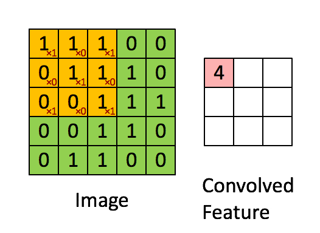
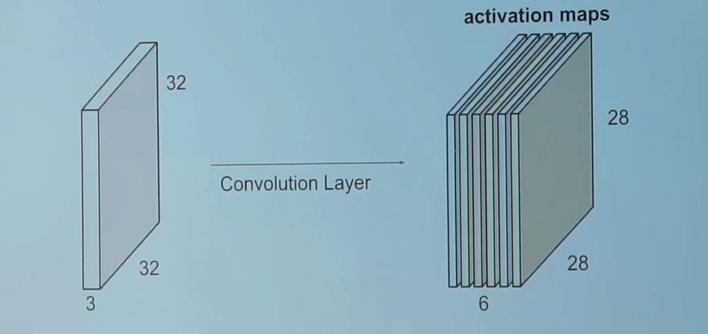
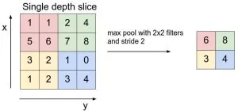
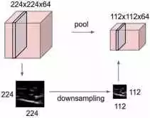
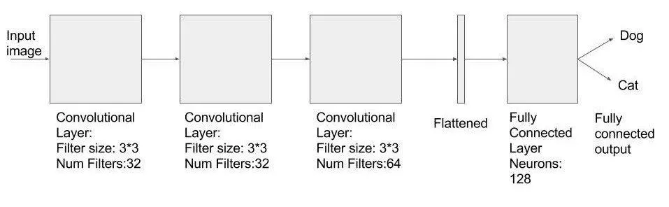
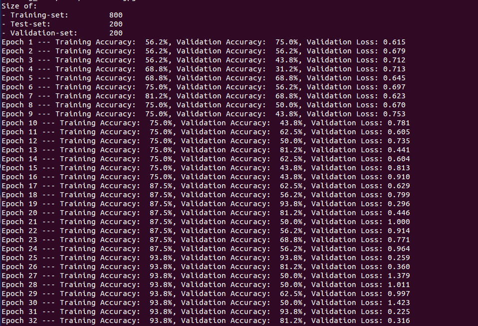

翻译：[Tensorflow Tutorial 2: image classifier using convolutional neural network](https://cv-tricks.com/tensorflow-tutorial/training-convolutional-neural-network-for-image-classification/)

# Tensorflow教程：使用卷积神经网络的图像分类器

在这个Tensorflow教程中，我们将使用Tensorflow构建一个基于卷积神经网络的图像分类器。如果您刚刚开始使用Tensorflow，那么最好[阅读这里的Tensorflow基本教程](https://cv-tricks.com/artificial-intelligence/deep-learning/deep-learning-frameworks/tensorflow/tensorflow-tutorial/)。

为了演示如何构建基于卷积神经网络的图像分类器，我们将构建一个6层神经网络来识别和分离狗和猫的图像。我们将要构建的这个网络是一个非常小的网络，可以在CPU上运行它。传统的神经网络在图像分类中有较多的参数，如果在CPU上进行训练，会花费大量的时间。然而，在本文中，我是向您展示的是如何使用Tensorflow而不是参与[ILSVRC](http://image-net.org/challenges/LSVRC/)来构建一个真实的卷积神经网络。在开始学习Tensorflow教程之前，让我们先介绍一下卷积神经网络的基础知识。如果您已经熟悉卷积神经网（conv-nets），您可以转到第2部分，即Tensorflow教程。

<!-- more -->

## 第1部分：卷积神经网络（CNN）基础

神经网络本质上是求解优化问题的数学模型。它们由神经元构成，神经元是神经网络的基本计算单元。一个神经元接受一个输入（比方说：$x$），对它做一些计算（比方说：用一个变量$w$乘以它，再加上另一个变量$b$）来产生一个值（比方说：$z = wx + b$）。这个值被传递给一个叫做**激活函数f（activation function）**的非线性函数，以产生神经元的最终输出（激活）。激活函数有很多种，**Sigmoid**是常用的激活函数之一，数学公式为：
$$
y = \frac{1}{1+e^{-z}}
$$
利用sigmoid函数作为激活函数的神经元称为**Sigmoid神经元（Sigmoid neuron）**。根据激活函数的不同，神经元可被命名为**RELU**、**TanH**等神经元（记住这一点）。一个神经元可以连接到多个神经元，就像这样：



在这个例子中，你可以看到**权值**（weight）是连接（connection）的属性，即每个连接都有不同的权值，而**偏差**（bias）是神经元的属性。这是产生输出y的sigmoid神经元的全图：
$$
z = b + \sum_{i}x_iw_i \\
y = \frac{1}{1+e^{-z}}
$$

### 神经层

如果你把神经元堆在一条直线上，这叫做一层。这是神经网络的下一个组成部分。


  

如上所示，

- 输入层：绿色的神经元构成了网络的第一层，输入数据通过第一层传递到网络。

- 输出层：如红色所示。

- 隐藏层：在输入层和输出层之间的层称为隐藏层。在这个例子中，我们只有一个用蓝色表示的隐藏层。具有许多隐含层的网络往往更精确，称为**深度网络**。而使用这些深度网络的机器学习算法称为**深度学习**。

### 神经层的类型

通常，一层中的所有神经元都进行类似的数学运算，这就是该层名称的由来（输入层和输出层除外，因为它们很少进行数学运算）。以下是你应该知道的最流行的神经层类型：

#### 卷积层（Convolutional Layer）

卷积是一种数学运算，用于单次处理中对信号进行滤波，寻找信号中的模式等。在卷积层中，所有的神经元都对输入进行卷积运算，因此称为卷积神经元。卷积神经元中最重要的参数是过滤器（filter）的大小，假设我们有一个过滤器大小为5\*5\*3的层。同样，假设输入到卷积神经元的是一个大小为32\*32的输入图像，有3个通道（即R、G、B）。



让我们从图像中选择一个5\*5\*3（彩色图像中有3个通道）大小的块，然后用过滤器（$w$）计算卷积（点积）。这个卷积运算将得到一个数字作为输出。我们还可以把偏置（$b$）加到这个输出中。



为了计算点积，过滤器的第三维数必须与输入的通道数相同。也就是说，当我们计算点积时，它是一个5\*5\*3的块与5\*5\*3的过滤器的矩阵乘法。

我们将在整个输入图像上滑动卷积过滤器来计算整个图像的输出，如下图所示：



在本例中，我们每次将窗口滑动1个像素。在某些情况下，会将窗口滑动超过1个像素。这个数字叫做**步长（stride）**。

如果将所有这些输出连接到2D中，我们将得到一个大小为28\*28的输出**激活图（activation map）**（您能想到为什么在过滤器为5\*5，步长为1时，是从32\*32到28\*28？）。如果我们的示例中有6个过滤器，那么输出的大小将是28\*28\*6。



正如您所看到的，每次卷积之后，输出的大小都会减小（在本例中，我们将从32\*32减小到28\*28）。在一个多层的深度神经网络中，这样的输出会变得非常小，但这并不能很好地工作。因此，在输入层的边界上进行0填充是一种标准做法，这样输出的大小就与输入层的大小相同。因此，在这个例子中，如果我们在输入层的两边都添加一个大小为2的填充，那么输出层的大小将是32\*32\*6，这从实现的目的来看也非常有用。假设您有一个大小为$N*N$的输入，过滤器（filter）的值为$F$，步长（stride）为$S$，有$P​$个0填充，那么输出大小为：
$$
(N - F + 2P)/S + 1
$$

#### 池化层（Pooling Layer）

在卷积层之后，将接着用池化层，以减小空间大小（只有宽度和高度，没有深度）。这减少了参数的数量，从而减少了计算量。此外，较少的参数避免了过拟合（overfit）（现在不用担心，稍后会详细介绍）。最常见的池的形式是**最大池（max pooling）**，我们取一个大小为F\*F的过滤器，并对图像的F\*F部分取其最大值。



如果你用平均值来代替最大值，它会被称为**平均池（average pooling）**，但它不是很流行。

如果你的输入大小为 $w1*h1*d1$ ，过滤器的大小为$f*f$ ，步长为$S$，那么输出大小为$w2*h2*d2$：
$$
w2 = (w1 - f)/S + 1 \\
h2 = (h1 - f)/S + 1 \\
d2 = d1
$$
最常见的池使用大小为2\*2的过滤器，步长为2。正如您可以使用上面的公式来计算，它减少了一半的输入大小。



#### 全连接层（Fully Connected Layer）

如果一层中的每个神经元都接收到上一层所有神经元的输入，那么这一层就称为**全连接层（fully connected layer）**。该层的输出由矩阵乘法和偏置偏移量计算。

### 理解训练过程

深层神经网络只不过是聪明的数学模型，在一定程度上模拟了人脑。当我们试图训练一个神经网络时，我们需要做2件基本的事情：

#### 网络的架构

当设计一个神经网络的架构时，你必须决定：如何安排层？使用哪些层？每一层使用多少个神经元等等？架构设计是一个比较复杂的、高难度的课题，需要大量的研究。有许多标准的架构可以很好地解决许多标准问题。例如AlexNet，GoogleNet，InceptionResnet，VGG等。在刚开始时，您应该只使用标准的网络架构。在您对神经网络有了很多经验之后，您就可以开始设计自己的网络架构了。因此，我们不必担心。

#### 正确的权重/参数

一旦您决定了网络的架构，那么，第二重要的就是权重$w$和偏差$b$或网络参数。**训练目标**是得到所有这些参数的最佳值，从而可靠地解决问题。例如，当我们正在努力构建狗和猫之间的分类器，我们希望找到合适的参数，在所有图片是狗的时候给出狗的概率为1（或者至少高于猫的概率）或者在所有图片是猫的时候，给出猫的概率为1（或者至少高于狗的概率）。

您可以使用一个称为**反向传播（Backward propagation）**的过程来找到最佳的参数集，也就是说，您从一个随机的参数集开始，并不断更改这些权重，直到对于每个训练图像，我们都能得到正确的输出。有许多优化器（optimizer）可以改变权重，这些优化器可以从数学角度快速地找到正确的权重。梯度下降（Gradient Descent）就是这样一种方法（反向传播和优化器是一个非常复杂的主题，但是我们现在不需要担心它，因为Tensorflow会处理它）。

因此，假设我们从一些参数的初值开始，并输入1张狗的训练图片（实际上是多张图片一起喂食（feed）），我们计算网络的输出为是狗的概率为0.1，是猫的概率为0.9。现在，我们做反向传播来**缓慢地改变**参数，这样在下一次迭代中，这个图片是狗的概率就会增加。有一个变量是用来控制我们在训练过程中改变网络参数的速度，叫**学习率（learning rate）**。如果您仔细想想，我们利用网络来最大化所有正确的分类（即我们关心整个训练集）。我们希望进行这些更改，使网络正确分类的数量增加。因此，我们定义了一个称为**代价（cost）**的数字，它表示训练是否在正确的方向上进行。**通常，cost的定义是这样的：随着代价的降低，网络的正确率将提高。**因此，我们关注cost，并不断地进行正向或反向传播的多次迭代（有时10s上千次），直到cost停止下降。cost有很多种定义，其中一个简单的是**均方根代价（mean root cost）**。假设$y_{prediction}$是对于所有训练图像网络输出的向量（vector），$y_{actual}$是对于这些标记图像的实际值（也叫ground truth）的向量。所以，如果我们最小化这两个变量之间的距离，这将是一个很好的训练指标。因此，我们将cost定义为所有图像的这些距离的平均值：
$$
cost=0.5 \sum_{i=0}^n (y_{actual}-y_{prediction})^2
$$
这是cost的一个非常简单的例子，但是在实际的训练中，我们使用了更复杂的cost度量，比如交叉熵代价（cross-entropy cost）。Tensorflow实现了很多这些cost，所以我们现在不需要担心这些cost的细节。

训练完成后，这些参数和架构将保存在一个二进制文件中（称为模型（model））。在生产设置中，当我们对一个新的狗/猫图像进行分类时，我们将该模型加载到相同的网络架构中，并计算出新图像是猫/狗的概率。这叫做**推理（inference）**或**预测（prediction）**。

为了计算简单，并不是所有的训练数据都同时被输入到网络中。假设，我们共有1600张图片，我们把它们分成小批，比如16张或32张，称为**批大小（batch-size）**。因此，将需要100或50轮（迭代）才能获得用于训练的完整数据。这被称为一个**历元（epoch）**，即在一个历元中，网络可以一次看到所有的训练图像。我们还需要做一些其他事情来提高准确性，但是我们现在不需要担心这些事情。

## 第2部分：Tensorflow教程->构建一个基于图像分类器的小型神经网络

在本教程中，我们将实现一个更小、更简单（与用于解决实际问题的网络相比）的网络，因此您也可以在cpu上训练它。在训练过程中，两个类别（狗/猫）的图像都被输入到一个卷积层，这个卷积层后面还有两个卷积层。在经过卷积层之后，我们将输出平化（flatten），并在最后添加两个完全连接层。第二个完全连接层只有两个输出，表示图像是猫或狗的概率。



### 先决条件

#### OpenCV

我们使用OpenCV读取猫/狗的图像，所以你必须安装它。

#### 形状函数（shape function）

如果你的TF中有多维张量，你可以这样做来得到它的形状：

```python
a = tf.truncated_normal([16,128,128,3])
sess = tf.Session()
sess.run(tf.initialize_all_variables())
sess.run(tf.shape(a))
```

输出：`array([ 16, 128, 128,   3], dtype=int32)`

你可以把它重塑成一个形状为[16  128\*128\*3]= [16 49152].新的二维张量。

```python
b=tf.reshape(a,[16,49152])
sess.run(tf.shape(b))
```

输出：`array([16, 49152], dtype=int32)`

#### Softmax

Softmax是一个函数，它将包含实值的k维向量$x$转换为$(0,1)$范围内实值的相同形状的向量，其和为1。我们将把softmax函数应用到卷积神经网络的输出中，以便将输出转换为每个类别的概率。
$$
o(x)_{j}= \frac{e^{x_{i}}}{ \sum_{n=1}^N e^{x_{n}}}    \,\, for  \, j=1….N
$$


### 获取输入

本文使用了来自[Kaggle dataset](https://www.kaggle.com/c/dogs-vs-cats)的2000张狗和猫的图片，但是您可以使用任何n个包含不同类型对象的图片文件夹。通常，我们将输入数据分为3部分：

1. **训练数据（training data）**：我们将使用80%即1600张图像进行训练。
2. **验证数据（validation data）**：20%的图像将用于验证。这些图像是从训练数据中提取出来的，在训练过程中独立计算精度。
3. **测试集（test set）**：独立的测试数据，其中约有400张图像。有时因为**过拟合（overfitting）**——经过训练后，神经网络开始对训练数据（非常相似的图像）非常好地工作着，即cost变得非常小，但它们不能很好地适应其他图像。例如，如果你在训练狗和猫之间的分类器，你从一个拍摄所有白色背景图片的人那里得到训练数据。您的网络可能在这个验证数据集上运行得很好，但是如果您试图在一个背景混乱的图像上运行它，那么很可能会失败。所以，这就是为什么我们试图从一个独立的源获取我们的测试集。

```python
classes = ['dogs', 'cats']
num_classes = len(classes)

train_path = 'training_data'

# validation split
validation_size = 0.2

# batch size
batch_size = 16

data = dataset.read_train_sets(train_path, img_size, classes, validation_size=validation_size)
```

dataset是我创建的一个类，用于读取输入数据。这是一个简单的python代码，从提供的训练和测试数据文件夹中读取图像。

我们的训练目标是：在网络中所有的神经元学习正确的权重/偏差值，这些神经元负责对狗和猫进行分类。这些权重的初值可以取任何值，但如果取正态分布（均值为零，方差较小），效果会更好。初始化网络还有其他方法，但正态分布更为普遍。让我们通过指定形状创建函数来快速初始化权重（请记住，我们在[前面的文章](https://cv-tricks.com/artificial-intelligence/deep-learning/deep-learning-frameworks/tensorflow/tensorflow-tutorial/)中讨论过`truncated_normal`函数）。

```python
def create_weights(shape):
    return tf.Variable(tf.truncated_normal(shape, stddev=0.05))

def create_biases(size):
    return tf.Variable(tf.constant(0.05, shape=[size]))
```

### 创建网络层

#### 在TensorFlow中建立卷积层（convolution layer）

`tf.nn.conv2d`函数可以用来构建一个卷积层，它接受以下输入：

- `input`=上一层的输出(激活)。这应该是一个4维张量。通常，在第一个卷积层中，你传递n张大小为width\*height\*num_channels的图像，然后这个图像的大小为`[n, width, height, num_channels]`
- `filter`=定义过滤器的可训练变量。我们从一个随机正态分布开始学习这些权重。它是一个4维张量，它的形状是网络架构设计的一部分。如果你的过滤器大小为filter_size\*filter_size，并且输入的大小是num_input_channels，并且你的当前层中有num_filters个过滤器，那么`filter`将具有以下形状：`[filter_size, filter_size, num_input_channels, num_filters]`
- `stride`=定义了卷积时过滤器的步长。在这个函数中，它需要是一个>=4的张量（Tensor），即`[batch_stride, x_stride, y_stride, depth_stride]`。batch_stride总为1，因为您不想跳过批处理中的图像。x_stride和y_stride基本相同，可选择值是网络架构设计的一部分，在我们的例子中将对它取1。depth_stride总是设置为1，因为您不会跳过深度。
- `padding`=**SAME**表示输入为0，这样输出的x、y维度与输入相同。

卷积之后，我们给神经元加上偏置（bias），这也是可以学习的/可训练的。我们还是从随机正态分布开始，然后在训练中学习这些值。

现在，我们通过`tf.nn.max_pool`函数应用最大池化，该函数与conv2d函数具有非常相似的形状。

```python
tf.nn.max_pool(value=layer, ksize=[1, 2, 2, 1], strides=[1, 2, 2, 1], padding='SAME')
```

注意，我们使用2\*2的k_size/filter_size，在x和y方向上的步长都是2。如果使用前面提到的公式$w2= (w1-f)/S +1;h2=(h1-f)/S +1$，我们可以看到输出恰好是输入的一半。这些是最大池化时最常用的值。

最后，我们使用一个RELU作为我们的激活函数，它只接受max_pool的输出，通过`tf.nn.relu`来应用RELU。

所有这些操作都是在一个卷积层中完成的。让我们创建一个函数来定义一个完整的卷积层。

```python
def create_convolutional_layer(input,
               num_input_channels, 
               conv_filter_size,        
               num_filters):  
    
    ## We shall define the weights that will be trained using create_weights function.
    weights = create_weights(shape=[conv_filter_size, conv_filter_size, num_input_channels, num_filters])
    ## We create biases using the create_biases function. These are also trained.
    biases = create_biases(num_filters)

    ## Creating the convolutional layer
    layer = tf.nn.conv2d(input=input,
                     filter=weights,
                     strides=[1, 1, 1, 1],
                     padding='SAME')

    layer += biases

    ## We shall be using max-pooling.  
    layer = tf.nn.max_pool(value=layer,
                            ksize=[1, 2, 2, 1],
                            strides=[1, 2, 2, 1],
                            padding='SAME')
    ## Output of pooling is fed to Relu which is the activation function for us.
    layer = tf.nn.relu(layer)

    return layer
```

#### 平层（FLattening layer）

卷积层的输出是一个多维张量。我们想把它转换成一维张量。这是在平层中完成的。我们只需要使用`reshape`来创建一个定义如下的一维张量：

```python
def create_flatten_layer(layer):
    layer_shape = layer.get_shape()
    num_features = layer_shape[1:4].num_elements()
    layer = tf.reshape(layer, [-1, num_features])

    return layer
```

#### 全连接层（Fully connected layer）

现在，让我们定义一个函数来创建一个全连接层。和其他层一样，我们将权重和偏置声明为随机正态分布。在全连接层中，我们取所有的输入，对其进行标准的$z=wx+b$运算。此外，有时还需要添加一个非线性（RELU）。因此，让我们添加一个允许调用者向层添加RELU条件。

```python
def create_fc_layer(input,          
             num_inputs,    
             num_outputs,
             use_relu=True):
    
    #Let's define trainable weights and biases.
    weights = create_weights(shape=[num_inputs, num_outputs])
    biases = create_biases(num_outputs)

    layer = tf.matmul(input, weights) + biases
    if use_relu:
        layer = tf.nn.relu(layer)

    return layer
```

现在，我们已经定义好了网络的构建代码块。

#### 占位符（placeholder）和输入（input）

现在，让我们创建一个占位符来保存输入的训练图像。所有输入的图像都在`dataset.py`文件中读取，并将大小调整为128 x 128 x 3。输入占位符`x`的形状是`[None, 128, 128, 3]`。第一个维度为None意味着可以向它传递任意数量的图像。在这个程序中，我们将以批大小为16来输入图像，即`[16, 128, 128, 3]`。类似地，我们创建一个占位符`y_true`来存储预测值。对于每个图像，我们有两个输出，即每个类类别的概率（狗的概率和猫的概率）。因此`y_pred`的形状是`[None, 2]`（对于批大小为16的数据，它将是`[16, 2]`）。

```python
x = tf.placeholder(tf.float32, shape=[None, img_size,img_size,num_channels], name='x')

y_true = tf.placeholder(tf.float32, shape=[None, num_classes], name='y_true')
y_true_cls = tf.argmax(y_true, dimension=1)
```

#### 网络设计

我们使用上面定义的函数来创建网络的各个层。

```python
layer_conv1 = create_convolutional_layer(input=x,
               num_input_channels=num_channels,
               conv_filter_size=filter_size_conv1,
               num_filters=num_filters_conv1)

layer_conv2 = create_convolutional_layer(input=layer_conv1,
               num_input_channels=num_filters_conv1,
               conv_filter_size=filter_size_conv2,
               num_filters=num_filters_conv2)

layer_conv3= create_convolutional_layer(input=layer_conv2,
               num_input_channels=num_filters_conv2,
               conv_filter_size=filter_size_conv3,
               num_filters=num_filters_conv3)
          
layer_flat = create_flatten_layer(layer_conv3)

layer_fc1 = create_fc_layer(input=layer_flat,
                     num_inputs=layer_flat.get_shape()[1:4].num_elements(),
                     num_outputs=fc_layer_size,
                     use_relu=True)

layer_fc2 = create_fc_layer(input=layer_fc1,
                     num_inputs=fc_layer_size,
                     num_outputs=num_classes,
                     use_relu=False)
```

#### 预测

如上所述，通过将softmax应用于全连接层的输出上，这样可以得到每个类的概率。

`y_pred = tf.nn.softmax(layer_fc2,name="y_pred")`

`y_pred`包含着每个类别对每个输入图像的预测概率。具有较高概率的类别是对网络的预测。

`y_pred_cls = tf.argmax(y_pred, dimension=1)`

现在，让我们定义最小的代价来取得权重的最优值。我们将使用一个简单的代价，它将使用Tensorflow的`softmax_cross_entropy_with_logits`函数来计算，softmax_cross_entropy_with_logits使用上一个全连接层的输出和实际标记值来计算交叉熵（cross_entropy），其平均值将是代价。

```python
cross_entropy = tf.nn.softmax_cross_entropy_with_logits(logits=layer_fc2,
                                                    labels=y_true)
cost = tf.reduce_mean(cross_entropy)
```

#### 最优化

Tensorflow实现了大部分最优化算法。我们将使用AdamOptimizer进行梯度计算和权重优化。我们将明确指出，我们正试图以0.0001的学习率来最小化代价。

```python
optimizer = tf.train.AdamOptimizer(learning_rate=1e-4).minimize(cost)
```

译文：如您所知，如果我们为了计算代价值，要在`session.run()`中运行优化器操作，则必须运行整个网络，并在`feed_dict`中传递训练图像（这有意义吗？想想看，你需要在代码中用什么变量来计算代价并保持上升）。在每次迭代中，以批大小（batch_size）为16的形式传递训练图像。

```python
batch_size = 16

x_batch, y_true_batch, _, cls_batch = data.train.next_batch(batch_size)

feed_dict_train = {x: x_batch, y_true: y_true_batch}

session.run(optimizer, feed_dict=feed_dict_tr)
```

其中`next_batch`是`dataset.py`文件中的一个简单的python函数，它返回接下来要传递给训练的16张图像。类似地，我们单独地将验证批次图像传递给另一个`session.run()`调用。

```python
x_valid_batch, y_valid_batch, _, valid_cls_batch = data.valid.next_batch(train_batch_size)

feed_dict_val = {x: x_valid_batch, y_true: y_valid_batch}

val_loss = session.run(cost, feed_dict=feed_dict_val)
```

注意，在本例中，我们将在`session.run()`中传递代价，使用的是一批验证图像，而不是训练图像。为了计算代价，整个网络（3个卷积+1个平化+2个全连接层）将被执行并生成`layer_fc2`（这将被计算交叉熵和代价）。然而，与训练相反，这次优化`optimizer = tf.train.AdamOptimizer(learning_rate=1 - e-4). minimum (cost)`将不会被运行（因为我们只需要计算代价）。这就是改变梯度和权重的原因，并且该计算非常昂贵。我们可以使用真标签（y_true）和预测标签（y_pred）来计算验证集的准确度。

```
correct_prediction = tf.equal(y_pred_cls, y_true_cls)
accuracy = tf.reduce_mean(tf.cast(correct_prediction, tf.float32))
```

我们可以通过在`session.run()`中传递`accuracy`并在`feed_dict`中提供验证集图像来计算验证集的准确度。

`val_acc = session.run(accuracy, feed_dict=feed_dict_validate)`

同样，我们也得到了训练图像的准确度。

`acc = session.run(accuracy, feed_dict=feed_dict_train)`

由于使用训练图像和标签进行训练，所以一般训练集的准确度要高于验证集。我们计算训练集的准确度是为了知道我们是在朝着正确的方向前进，并且至少提高了训练数据集的准确度。在每个历元（epoch）之后，我们得到了准确度的具体数值并用Tensorflow中的`saver`对象来保存模型。

```python
saver.save(session, 'dogs-cats-model')
```

这是完整的训练函数：

```python
def train(num_iteration):
    global total_iterations
    
    for i in range(total_iterations, total_iterations + num_iteration):
        x_batch, y_true_batch, _, cls_batch = data.train.next_batch(batch_size)
        x_valid_batch, y_valid_batch, _, valid_cls_batch = data.valid.next_batch(batch_size)
        
        feed_dict_tr = {x: x_batch, y_true: y_true_batch}
        feed_dict_val = {x: x_valid_batch, y_true: y_valid_batch}

        session.run(optimizer, feed_dict=feed_dict_tr)

        if i % int(data.train.num_examples/batch_size) == 0: 
            val_loss = session.run(cost, feed_dict=feed_dict_val)
            epoch = int(i / int(data.train.num_examples/batch_size))    
            
            show_progress(epoch, feed_dict_tr, feed_dict_val, val_loss)
            saver.save(session, 'dogs-cats-model') 

    total_iterations += num_iteration
```

译文：因为这是一个真实的例子，所以这段代码有点长。那么，请到[这里](https://github.com/sankit1/cv-tricks.com)克隆代码并运行train.py文件来开始训练。这是输出的结果：



这是一个小型的网络，也并不是最先进的方式去建立一个图像分类器，但它是非常好的学习例子，特别是当你刚刚开始。在我们的训练中，验证集上有80%以上的准确率。由于我们在训练中保存了模型，接下来将用在我们自己的图像上运行。

### 预测

当你训练完后，你会注意到文件夹中有很多新文件：

1. dogs-cats-model.meta
2. dogs-cats-model.data-00000-of-00001
3. dogs-cats-model.index
4. checkpoint

`dogs-cats-model.meta`包含了完整的网络图，稍后我们可以使用它重新创建该图。我们将使用Tensorflow提供的一个`saver`对象来实现这一点。

```python
saver = tf.train.import_meta_graph('flowers-model.meta')
```

`dogs-cats-model.data-00000-of-00001`包含了网络的训练权重（变量的值）。因此，一旦我们重新创建了图，我们由此恢复权重。

```python
saver.restore(sess, tf.train.latest_checkpoint('./'))
```

为了得到网络的预测值，我们需要像训练一样对输入图像进行读取和预处理，在计算图上获取`y_pred`，并在`feed_dict`中传递新的图像。如下所做：

```python
image = cv2.imread(filename)
# Resizing the image to our desired size and
# preprocessing will be done exactly as done during training
image = cv2.resize(image, (image_size, image_size), cv2.INTER_LINEAR)
images.append(image)
images = np.array(images, dtype=np.uint8)
images = images.astype('float32')
images = np.multiply(images, 1.0/255.0) 
#The input to the network is of shape [None image_size image_size num_channels]. Hence we reshape.
x_batch = images.reshape(1, image_size,image_size,num_channels)


graph = tf.get_default_graph()

y_pred = graph.get_tensor_by_name("y_pred:0")

## Let's feed the images to the input placeholders
x= graph.get_tensor_by_name("x:0") 
y_true = graph.get_tensor_by_name("y_true:0") 
y_test_images = np.zeros((1, 2)) 

feed_dict_testing = {x: x_batch, y_true: y_test_images}
result=sess.run(y_pred, feed_dict=feed_dict_testing)
```

最后，我们可以运行该脚本来对一个新的狗/猫图像进行预测。

```python
python predict.py test_dog.jpg
[[ 0.99398661  0.00601341]]
```

输出包含了输入图像为狗或猫的概率。在这个例子中，狗的概率比猫高。

恭喜你！您已经学习了如何使用卷积神经网络来构建和训练图像分类器。

训练好的模型和数据：在git存储库中，我只为每个类别添加了500个图像。但是，即使训练一个像样的分类器，也需要500多张狗/猫的图片。所以，我对这个模型在每个类别上训练了2400张图片。你可以从这里下载这些图片。这个小型的cat-dog-dataset是Kaggle Dog-Cat数据集的子集，不归我们所有。你还可以使用我这里提供的[训练好的模型](https://drive.google.com/open?id=0B2L-gJqoC67Tb3h5WUw2djVuSVk)来生成预测值。

完整的代码可以在[这里](https://github.com/sankit1/cv-tricks.com)找到。请在下面的评论中告诉我你的问题和反馈。这些评论和反馈是我创做更多教程的动力🙂。